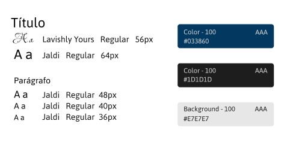

<h1>Design System - Formação UX Designer</h1>

  

    No projeto pelo instrutor, tivemos que criar um design system, podia ser pensando em algum site ou produto, ou até mesmo pensando em um estilo para o modelo que criamos no projeto passado (wireframe).
  

  

    <h3>O que é um design system? </h3>
    Design System é uma coleção de componentes reutilizáveis, padronizados para determinado produto.
  

  <h3>Meu projeto</h3>
  

    Para o meu projeto eu escolhi dois tipos de fonte, um que era utilizado em títulos e também para textos "comuns" e um outro somente para títulos específicos, são eles: <b>Lavishly Yours</b> e <b>Jaldi</b>, sendo o Jaldi utilizado em títulos e textos.
  

  

    Para as cores escolhi utilizar somente 3, para deixar o design mais minimalista. São as cores: <b> #033860 </b>, <b> #1D1D1D </b> e <b> #E7E7E7 </b>.
  

  

    Para melhor entendimento, veja a imagem a baixo:
  

  

 
 

  Feito com 💜  por Karoliny

